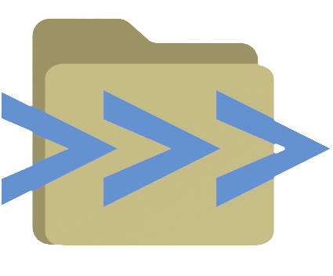
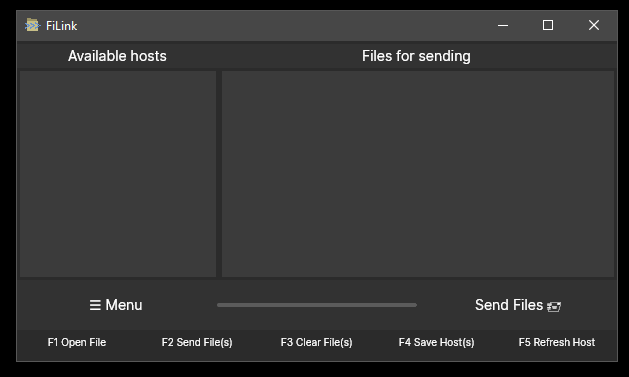
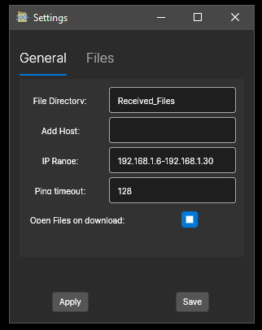

 <h1> FiLink </h1> 
    
## Summary

FiLink is a peer-to-peer file transfer application with support for both GUI and CLI interfaces. 
The application helps transferring files and directories within LAN network and in the way it functions 
it is very similar to [LanDrop](https://landrop.app/), which is partially inspired by.

I made this application in order to learn more about .Net/C#, AvaloniaUI, MVVM, Task, Threads, and Network programming.
Although it's far from ideal and by no means is production ready, it does function and looks pretty nice and i'm quite happy with it.
I'm not sure if I'll do any further development, but I'm happy to receive any constructive feedback.
## Screenshots

 
Main FiLink window

 
Settings window

## Features

- Transfer files and directories between computers in the same network (LAN).
- Cross platform: supports Windows and Linux
- Automatic host detection (works most of the time) 
- Low impact on system resources 
- Oldschool GUI
- CLI support for *automatization*  

  
## Authors

- [@Banogrono](https://github.com/Banogrono)

  
